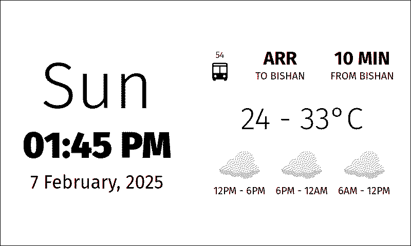

# eink-screen-esp32

This is a monorepo containing some simple code for a simple web app that controls my eink screen (with an ESP32 driver).

## Software

There are 2 distinct codebases:

1. Backend (`/backend`) - web interface and API server
2. MCU codebase (`/mcu`) - code that runs on the eink screen MCU

The general set-up is as follows:

- The backend runs on a sever (via Docker)
- Users use the web interface to configure the display
- The MCU connects to WiFi and periodically fetches an image from the backend and displays it

## Hardware

- [Waveshare 800×480, 7.5inch E-Ink raw display, red/white/black](https://www.waveshare.com/7.5inch-e-paper.htm)
- [Waveshare Universal e-Paper Raw Panel Driver Board, ESP32 WiFi / Bluetooth Wireless](https://www.waveshare.com/e-paper-esp32-driver-board.htm)
